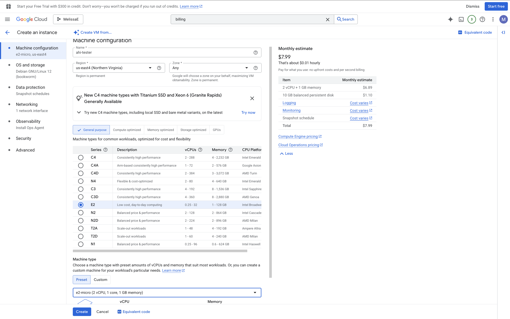
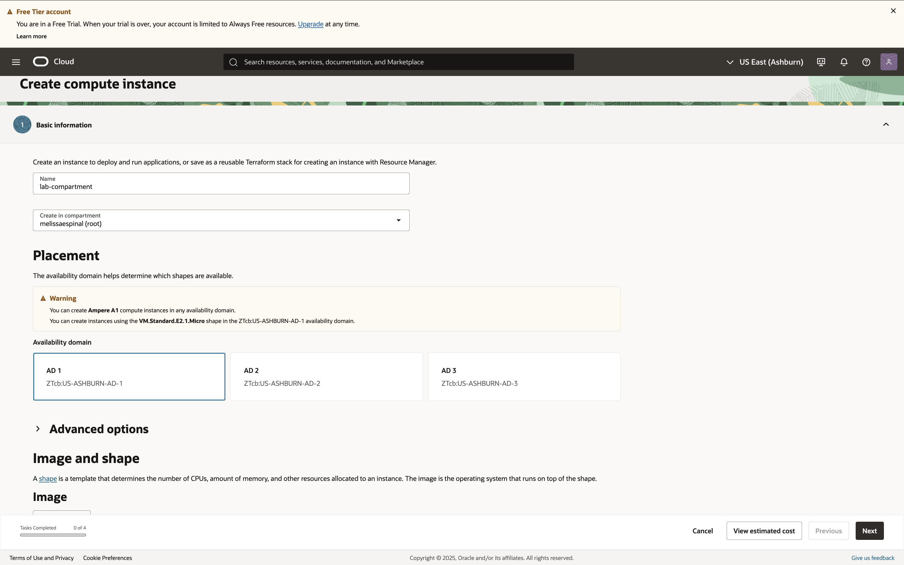
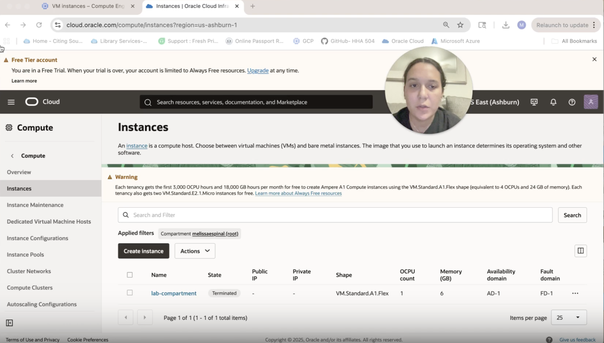

# gcp_oci_vm_start
GCP and OCI step by step tutorial
# Virtual Machine Tutorial: GCP & OCI

**Recording:** [Watch on Loom](https://www.loom.com/share/3083d00be535445b97c2cb42f8e749ec?sid=a3792a61-d27b-4e74-8951-efa0eb55a19b)

## Prereqs
- Google Cloud Platform (GCP)
- Oracle Cloud Infrastructure (OCI)
- Smallest free/tier shapes and images

## Part 1: Google Cloud Platform (GCP)

### Step 1: Create a VM
- Go to **Compute Engine** > **VM Instances** > **Create**
- Fill in instance name using lower case letters, example: **ahi-tester**
- Region & Zone: Choose a location closest to you
- Machine type: Leave as default
   - Select (e2-micro)
- Leave defaults unless specified
- Click on OS and Storage on the left hand side
	- Change the operating system to **Ubuntu**
-Click **Create**

### Step 2: Running Instance
- After clicking **Create**, wait until status is **Running**

### Step 3: SSH Update
- Click Secure Shell to open a terminal in the browser
	- From here, you can install software, run scripts, or configure your server just like you would on a physical machine 
- To uppdate, type in the following in your terminal:
	 1. **sudo**(space)**apt-get**(space)**update** (enter)
     2. **python3** (enter)
     3. **exit()** (enter)
     4. **pwd** (enter)

### Step 4: Stop/Terminate VM
- Click on the 3 dots
- Click **Delete**
- We do not care about a graceful shutdown, click **Delete**

*Pitfall:* Don’t forget to delete the VM — leaving it running may cost money.

## Part 2: Oracle Cloud Infrastructure (OCI)

### Step 1: Create a VM
- Go to **Compute** > **Instances** > **Create Instance**
- Configure the VM
	- Change name to **lab- compartment**
 	- Select Image and choose **Ubuntu**
	- Select shape and change to **Ampere** and select **A1. flex**
	- Under **Networking** click create new virtual cloud network and it automatically chooses create new public subnet
	- SSH Keys is optional, leave as default and it will generate a key pair
	- Click **Create**

### Step 2: Running Instance
- Wait until instance state is **Running**

### Step 3: Stop/ Terminate VM
- Select the instance
- Click **Terminate** with **Delete the boot volume checked**
- Cleanup check. Confirm no instances, boot volumes, or public IPs remain.

## Reflections
### Similarities
- Both require you to choose: which Machine type
	- OS image and Storage
### Differences
- GCP has networking pre-configured
- GCP assigns public IP
- GCP lets you access SSH with your Google account directly.
- OCI makes you set up VCNs and subnets, which feels more complicated
- OCI requires a public subnet
- OCI requires uploading or generating an SSH key.
### Preference 
- I think for  beginners: GCP is easier because of the automatic setup and Google account integration,
	but for someone who wants to have more control, OCI is is a better option.
