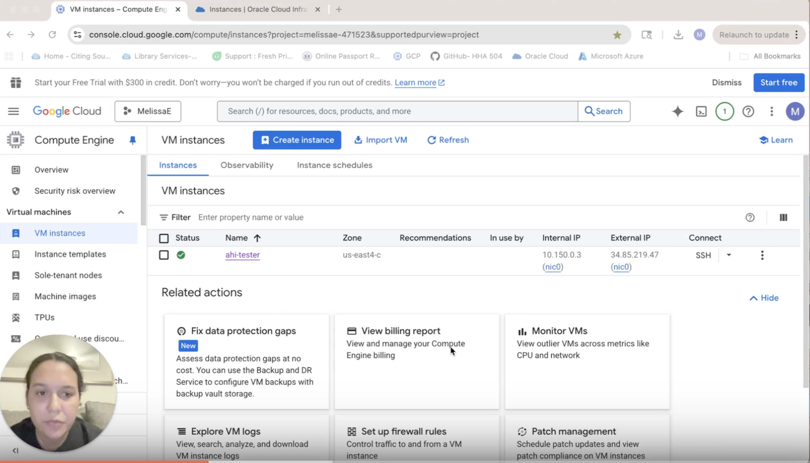
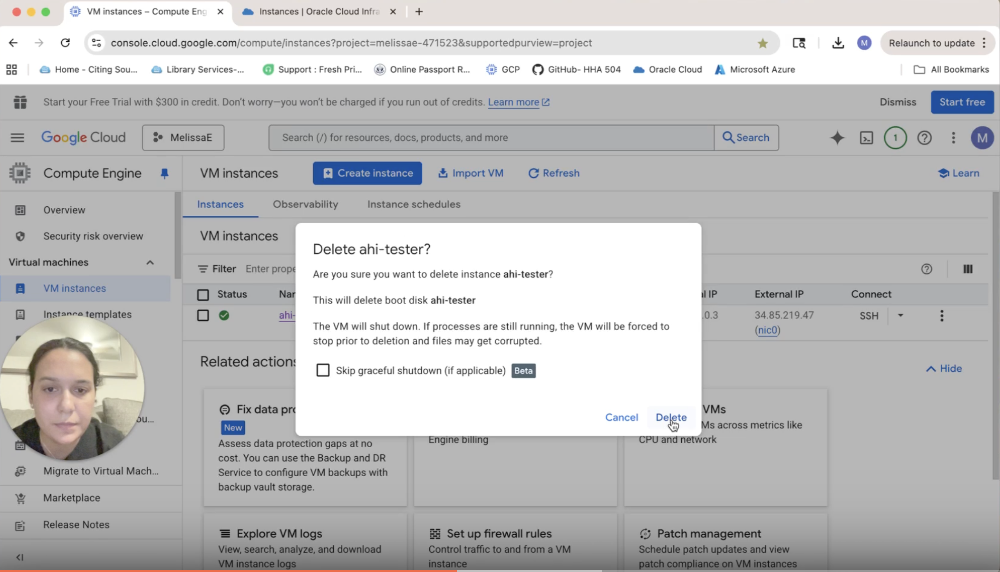
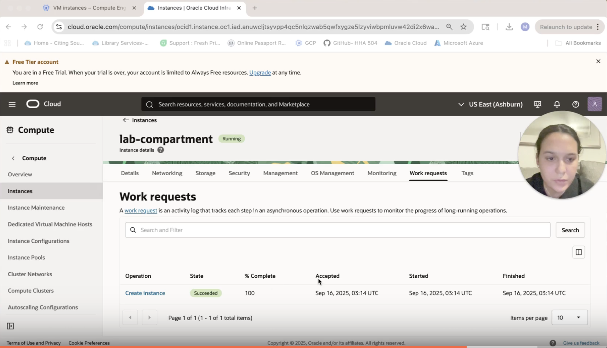

# gcp_oci_vm_start
GCP and OCI step by step tutorial
# Vitual Machine Tutorial: GCP & OCI

**Recording:** [Watch on Loom](https://www.loom.com/share/3083d00be535445b97c2cb42f8e749ec?sid=a3792a61-d27b-4e74-8951-efa0eb55a19b)

## Part 1: Google Cloud Platform (GCP)

### Step 1: Create a VM
- Go to **Compute Engine** > **VM Instances** > **Create**.
- Fill in instance name, region (with region closest to you), machine type.
- Leave defaults unless specified.

### Step 2: Running Instance
- After clicking **Create**, wait until status is **Running**.

### Step 3: Terminate VM
- Select the VM.
- Click **Delete**.

⚠️ *Pitfall:* Don’t forget to delete the VM — leaving it running may cost credits.

---

## Part 2: Oracle Cloud Infrastructure (OCI)

### Step 1: Create a VM
- Go to **Compute** > **Instances** > **Create Instance**.
- Select image and shape.

### Step 2: Running Instance
- Wait until instance state is **Running**.

### Step 3: Terminate VM
- Select the instance.
- Click **Terminate**.

⚠️ *Pitfall:* You must select a **public subnet** if you need a public IP.
